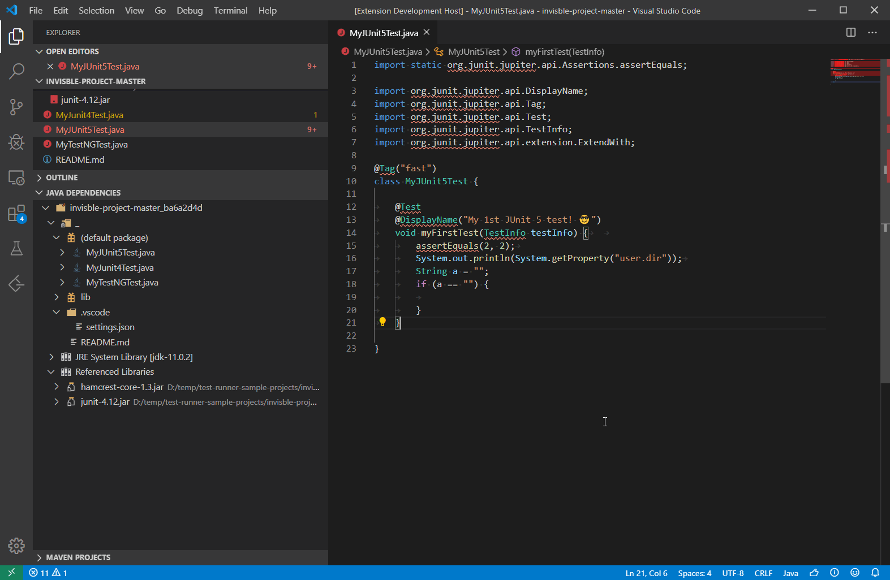

# Cool Language Jflex Scanner
A scanner with jflex for compiler course in Fall 2021 at Shahid Beheshti university.

## Screenshot
<hr>


## How To Run
<hr>

Based on your IDE (Vs Code, Intellij and etc...) and your operating system (windows,linux,...), add libraries jar files in the project classpath.
then simply Run Main.java file.

if you changed scanner.flex content, you must compile it with jflex again.

```
java -jar ./lib/jflex-full-1.8.2.jar ./src/flex/scanner.flex -d ./src/classes
```
adding dependencies in intellij:


adding dependencies in vs code:



input file is code.cool in files folder in src. output syntax, highlighter file is highlighter.html in files folder in src.

## Libraries
<hr>

<ul>
  <li>Jflex v1.8.2</li>
  <li>Jsoup v1.13.1</li>
</ul>

## Resources
<hr>

https://github.com/hamidhandid/compiler-jflex-scanner